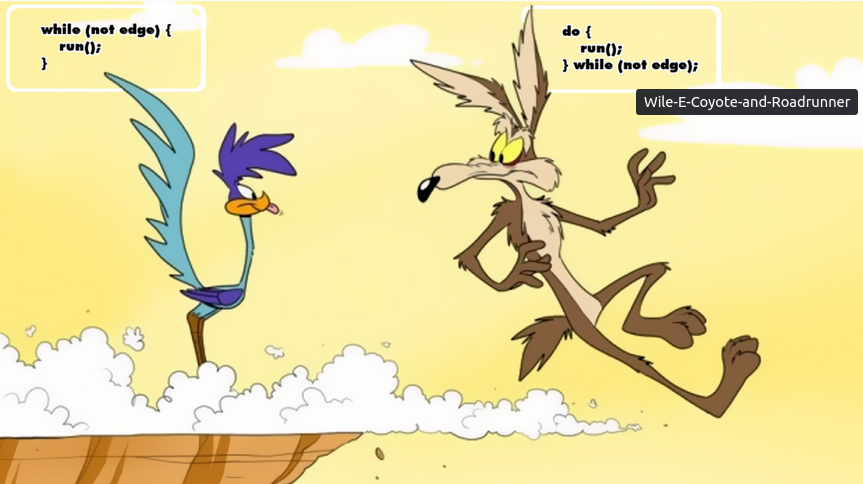

### Les conditions et les boucles 🔄

#### Les conditions

Les condition ou plus techniquement appelé instruction conditionnelle,
sont des fonction intégré aux langages de programmation permettant d'effectuer des actions en fonction d'une codition booléenne

la première instruction conditionnelle est le `if()`

- Le `if()` permet d'executer un block de code seulement si la condition est validé (`true`)


```javascript
if (true) {
  console.log('Validé!')
}
```

- Le `if()` est souvent utilisé avec des opérateurs (`>`, `<`, `==`, `>=` ...)

```javascript
if (10 > 5) {
  console.log('Supérieur!')
}
```

- Le `if()` peut prendre en paramètre des variables

```javascript
var age = 18
if (age >= 18) {
  console.log('Vous étes majeur')
}

var valide = true
if (valide) {
  console.log('Validé')
}
```

- Le `else` permet d'exectuer un block de code dans le cas ou le `if()` n'est pas validé

```javascript
var age = 16
if (age >= 18) {
  console.log('Vous étes majeur')
} else {
  console.log('Vous étes mineur')
}
```

- Le `else if()` permet de vérifier une nouvelle condition et de les assembler

```javascript
var age = 18
if (age >= 21) {
  console.log("Vous étes majeur à l'international")
} else if (age >= 18) {
  console.log('Vous étes majeur en France et en Belgique')
} else {
  console.log('Vous étes mineur')
}
```

- Il est possible de combiner des `if()` dans dans `if()` mais il faut savoir les limiter car c'est une mauvaise pratique

```javascript
var age = 18
if (age >= 18) {
  if (age >= 21) {
    console.log("Vous étes majeur à l'international")
  } else {
    console.log('Vous étes majeur en France et en Belgique')
  }
} else {
  console.log('Vous étes mineur')
}
```

- Il est possible de combiner de très nombreux `if` `else if()` mais c'est une mauvaise pratique et ca veut souvent dire qu'il y a un autre moyen de faire...

```javascript
if(condition) {}
else if (condition) {}
else if (condition) {}
else if (condition) {}
...
else if (condition) {}
else {}
```

- Il n'est pas obligé d'utiliser les accolades pour délémiter le bock de code mais il est très très recommandé pour la lisibilitée

```javascript
if (true) 
    console.log('Condition validé!');
else 
    console.log('Condition non validé!');
```


- Le `switch() case` est un variant du `if()` car il permet d'executer un block de code en fonction de l'état de la condition


- Le `switch() case` à un equivalent du else avec le `default` qui va être executé si aucun des `case` ne correspond


```javascript
const mois = 'Décembre';
switch (mois) {
  case 'Janvier':
    console.log('Votre signe est Verseau');
    break;

      case 'Février':
    console.log('Votre signe est Verseau');
    break;

      case 'Mars':
    console.log('Votre signe est Verseau');
    break;

    ...

      case 'Octobre':
    console.log('Votre signe est Scorpion');
    break;

      case 'Novembre':
    console.log('Votre signe est Sagittaire');
    break;

      case 'Décembre':
    console.log('Votre signe est Sagittaire');
    break;

  default:
    console.log('Le mois nexiste pas');
}

```
- Comme pour le `if() else` le `switch() case` il est recommandé de pas utiliser trop de conditions...

#### Les boucles
il existe trois types de boucles en procédurale:
- `for()`
- `while()`
- `do while()`

## For 

la boucle la plus utile et utilisé, il y en à partout !
le but de cette boucle est de partir d'une valeur initiale et d'avancer jusqu'a une valeur finale.

- `for()` se décompose en trois : initialization, condition et une expression finale

```javascript
//for ([initialization]; [condition]; [final-expression] {}
for (let jour = 1; jour < 365; jour++) {
    console.log("Jour :" + jour);
}
console.log("L'année est terminé!");
```

- l'étape d'initialization du for peut avoir nimporte qu'elle valeur

```javascript
//for ([initialization]; [condition]; [final-expression] {}
age = 18;
anneeCourante = 2022;
for (let annee = 1; annee < 60; annee++) {
    // exemple "A l'année 2025 vous aurez: 25 ans" -> jusqu'à 60
    console.log("A l'année " + anneeCourante + annee + " vous aurez " age + annee +" ans");
}
```

- l'étape de condition peut avoir n'importe qu'elle condition et à partir du moment ou elle est plus vraie la boucle `for()` va se terminer

```javascript
//for ([initialization]; [condition]; [final-expression] {}
// 2 , ensuite jour++ sera 3 et il ne sera plus pair donc ça va s'arréter
for (let jour = 2; jour % 2 == 0; jour++) {
    console.log("Jour :" + jour);
}

// 2 4 6 8 10, 12 sera supérieur et égal à 10
for (let jour = 2; jour <= 10>; jour++) {
    console.log("Jour :" + jour);
}

```


- l'étape d'expression finale permet de dire de combien on avance à chaque fois pour se rapprocher de la condition

```javascript
//for ([initialization]; [condition]; [final-expression] {}
// 2 4 6 8 10 ... 96 98, 100 ne sera plus inférieur à 100 donc il va s'executer 49 fois 
fois = 0;
for (let jour = 2; jour < 100; jour+=2) {
    console.log(++fois + " fois");
}

//for ([initialization]; [condition]; [final-expression] {}
// 2 4 8 16 32 64 - va s'executer 6 fois
for (let jour = 2; jour < 100; jour*=2) {
    console.log("Jour :" + jour);
}
```

## While 

la boucle moins utilisé mais pratique pour répéter une action tant que la condition n'est pas validé, on utilise le `while()` à la place du `for()` quand on ne sait pas combien de fois mais on sait ce qui va déclancher la fin de la boucle.

```javascript
while (i < 6) {
  console.log(`The value of i = ${i}`);
  i++;
}
```

```javascript
let randomResult = 0;
let loopCount = 0;

while (randomResult !== 8) {
  randomResult = Math.floor(Math.random() * (10 - 1 + 1) + 1);
  loopCount++;
}
```


```javascript
while(1) {
    playGame();
    if(exiteButton == true) {
        break;
    }
}
```

## Do while 

```javascript
do {
    document.write("ok");
} while(x == "10");
```

Est équivalent au while sauf qu'il va s'executer au moins une fois 

- La boucle while vérifie la condition au démarrage de la boucle et si la condition est satisfaite le bloc d’instructions sera exécutée. Dans la boucle do while, la condition est vérifiée après l’exécution de toutes les instructions du corps de la boucle.
- Si la condition dans une boucle while est fausse, aucune instruction à l’intérieur de la boucle n’est exécutée et si la condition dans la boucle do while est fausse, alors le corps de la boucle est exécuté au moins une fois la condition testée.



