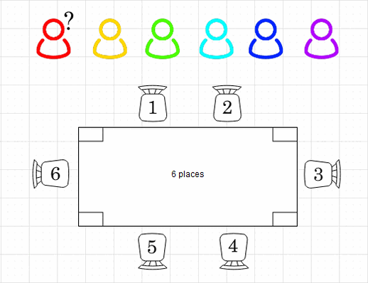
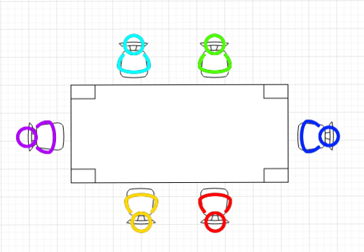
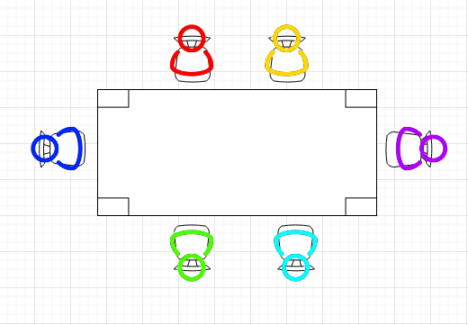
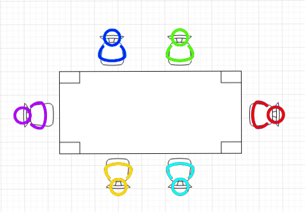

# Exo 3

Réaliser une fonction factorielle pour calculer le nombre possible d'arrangements pour l'organisation d'une salle de réunion selon le nombre de personnes.

Objectif: 
1. Demander à l'utilisateur combien de personnes il y aura lors de la réunion.
2. Créer une fonction factorielle qui va prendre le nombre de personnes et va calculer le nombre de possibilités d'arrangement.
3. Appeler cette fonction et afficher à l'écran le nombre de possibilités avec le nombre de personnes.

Rappel de l'arrangement mathématique pour ce cas concret:
L'arrangement est la disposition ordonnée d'un certain nombre d'éléments 🤔
C'est le nombre de possibilité d'organisation sans répéter les même cas, exemple:

6 personnes arrivent à une table de 6 places:
- Imaginons que le premier va pouvoir choisir 1 place parmis les 6, il aura donc 6 possibilités
- Le second va devoir choisir, il aura plus que 5 places pour en choisir 1
- Le troisième aura plus que 4 places pour choisir
- Le quatrième 3 places possibles
- Le cinquième 2 places possibles
- et le dernier il aura plus trop le choix...

Imaginons que ensuite on refasse l'organisation mais avec un ordre différent et ça jusqu'à avoir toute les possibilités possibles:

Première possibilité:

Seconde possibilité:

Troisième possibilité:

Il y en a encore beaucoup d'autre...

Pour calculer les possibilité on va utiliser une fonction mathématique appelé factorielle et qui s'écrit avec un point d'esclamation:
`6! = 720` soit 720 possibilités d'organisation,
pourquoi car :
- le premier à 6 possibilité
- le second 5
- le troisième 4
- le quatriéme 3
- le cinquième 2
- et le dernier 1 
donc : 6 * 5 * 4 * 3 * 2 * 1 = 720 

Du coup pour faire ça sous forme d'un algo 🤔 
il faut créer une fonction factorielle qui va prendre le nombre de personne en paramètre appelé `n`
va multiplier ce nombre de personne par la même fonction factorielle avec `n - 1` tant qu'elle n'est pas arrivé à la dernière personne...
